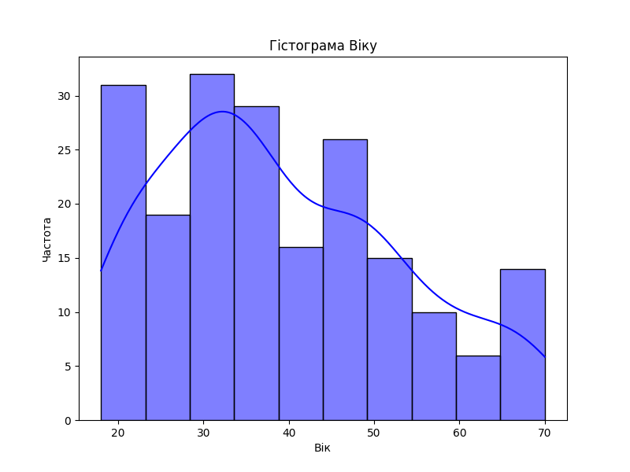
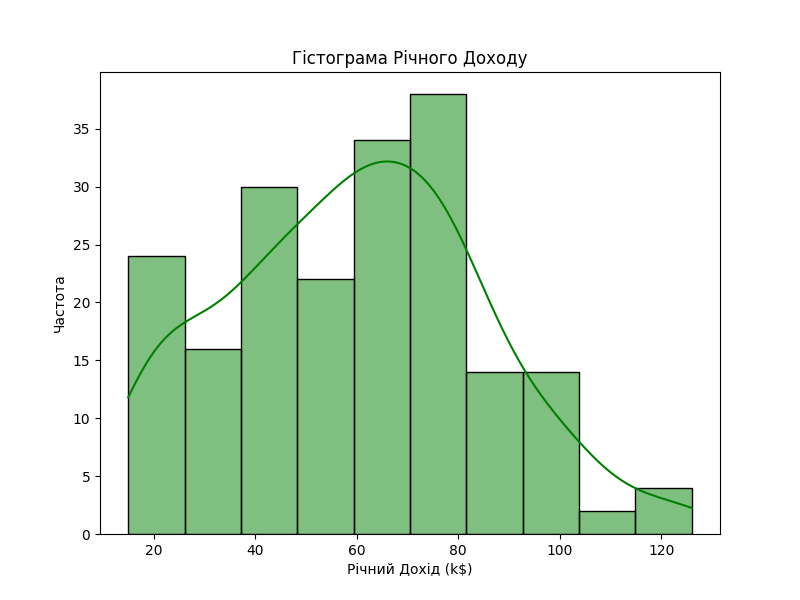
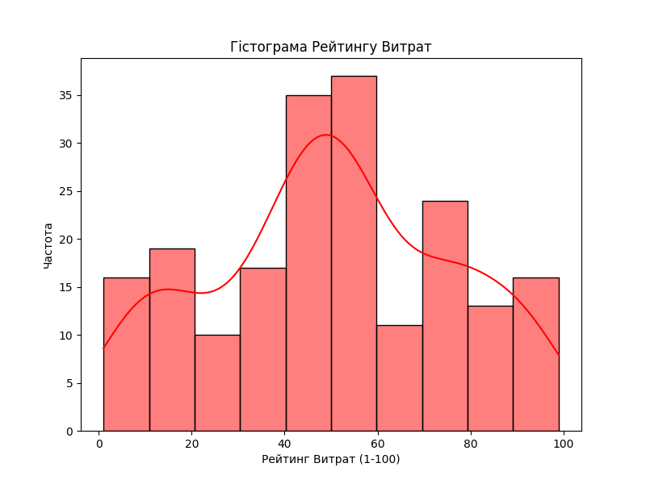
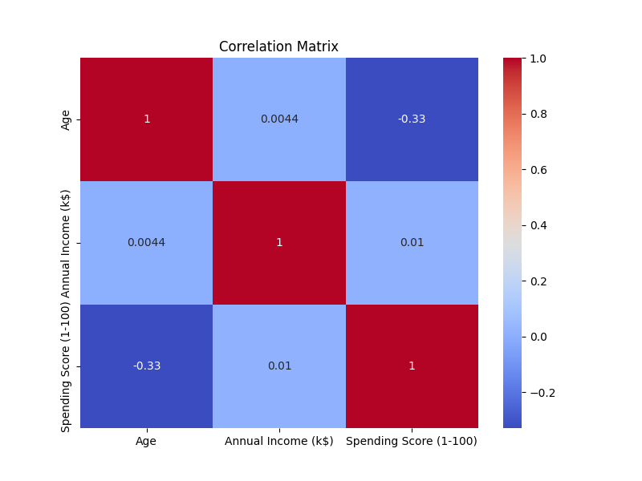
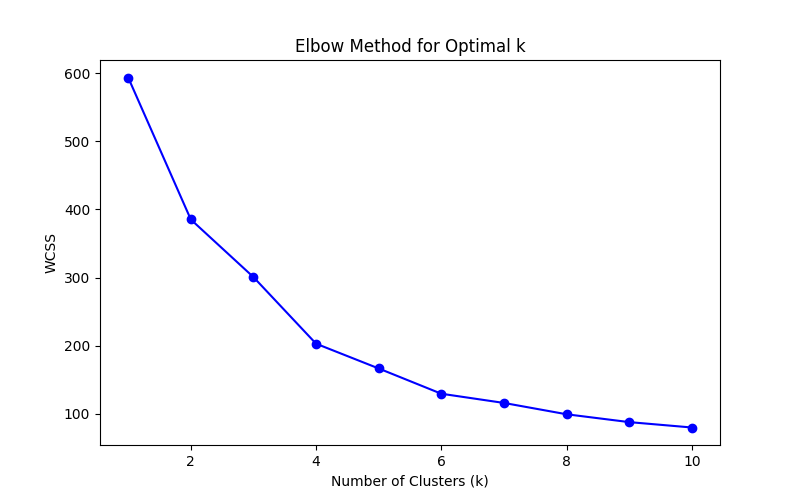
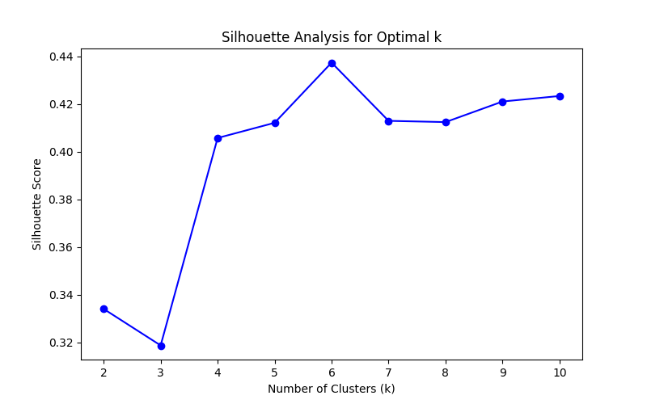
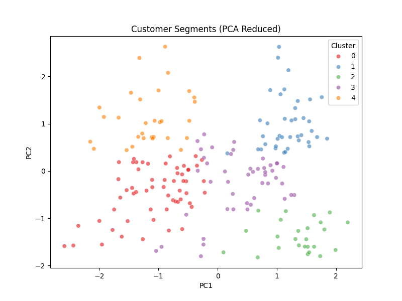
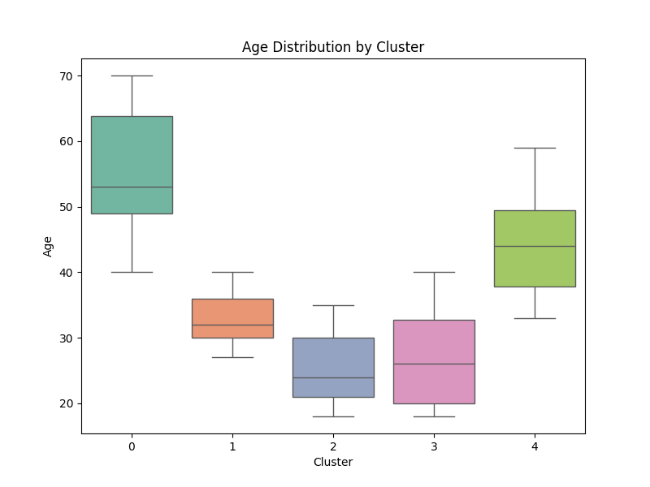
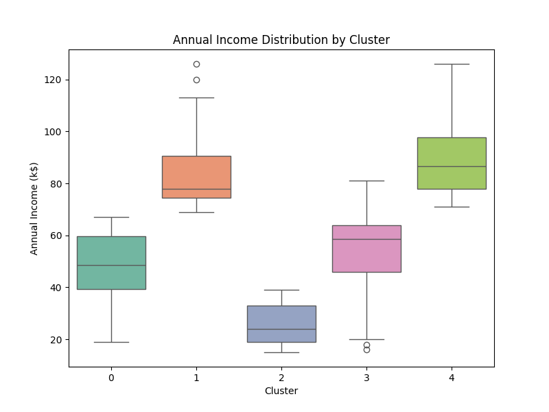
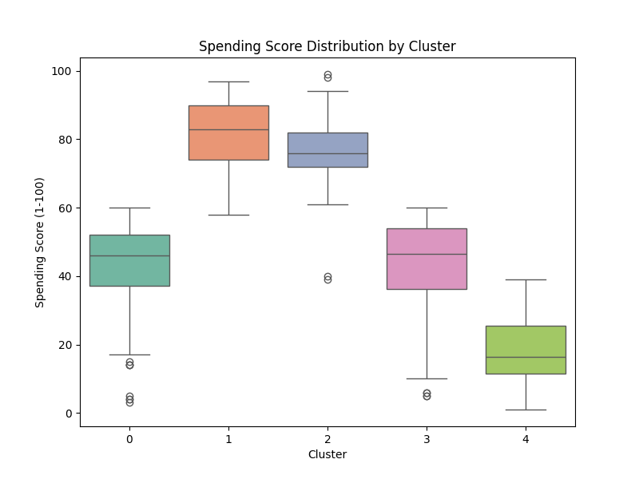

# Лабораторна робота №2  
### з дисципліни "Основи Data Mining"  
### студента групи ТТП-42  
### Ходакова Максима Олеговича

---

## Тема: Сегментація клієнтів

---

## Мета роботи

Ознайомлення з методами кластеризації для сегментації клієнтів на основі їхніх характеристик з використанням алгоритму K-Means. Навчитися підготовці даних, проведенню досліджувального аналізу даних (EDA), вибору оптимальної кількості кластерів, виконанню кластеризації, оцінці якості кластерів та візуалізації результатів.

---

## Завдання

1. **Передобробка Даних**
   - Завантаження та очищення даних.
   - Вибір релевантних ознак для кластеризації.
   - Масштабування даних для забезпечення рівного внеску ознак у кластеризацію.

2. **Досліджувальний Аналіз Даних (EDA)**
   - Аналіз розподілу ключових змінних.
   - Візуалізація взаємозв'язків між ознаками.

3. **Реалізація K-Means Кластеризації**
   - Визначення оптимальної кількості кластерів за допомогою Методу Ліктя та Аналізу Силуетів.
   - Виконання кластеризації та призначення міток кластерів клієнтам.
   - Аналіз характеристик кожного кластеру.

4. **Оцінка Якості Кластерів**
   - Використання метрик для оцінки якості кластеризації.
   - Інтерпретація результатів у контексті бізнес-задачі.

5. **Візуалізація Результатів**
   - Застосування PCA для зменшення вимірності даних та візуалізації кластерів.
   - Створення діаграм для ілюстрації характеристик кластерів.

---

## Хід роботи

### 1. Передобробка Даних

#### Завантаження та Очищення Даних

Спочатку було завантажено набір даних `Mall_Customers.csv`, який містить інформацію про клієнтів торгового центру, включаючи їхній вік, стать, річний дохід та рейтинг витрат. Було проведено перевірку на відсутні значення та дублікати, після чого видалено дублікати для забезпечення якості даних. Також здійснено виявлення та обробку викидів за допомогою методу міжквартильного розмаху (IQR) для кожної з числових ознак.

#### Вибір Ознак

Було обрано три основні ознаки для кластеризації:
- Вік (`Age`)
- Річний дохід (`Annual Income (k$)`)
- Рейтинг витрат (`Spending Score (1-100)`)

#### Масштабування Даних

Для забезпечення рівного внеску всіх ознак у процес кластеризації дані були масштабовані за допомогою стандартного масштабування (StandardScaler), що дозволяє уникнути домінування однієї ознаки над іншою через різні масштаби значень.

### 2. Досліджувальний Аналіз Даних (EDA)

Проведено описову статистику обраних ознак, що дозволило отримати уявлення про їх розподіл та центральні тенденції. Побудовано гістограми для візуалізації розподілу кожної ознаки, а також парні діаграми (pairplot) для аналізу взаємозв'язків між ознаками. Матриця кореляції була створена для виявлення кореляцій між ознаками, що допомогло у виборі найбільш релевантних для кластеризації.

### 3. Реалізація K-Means Кластеризації

#### Вибір Кількості Кластерів (k)

Для визначення оптимальної кількості кластерів було використано два методи:
- **Метод Ліктя:** Аналіз кривої залежності суми квадратів відстаней до центру кластера (WCSS) від кількості кластерів.
- **Аналіз Силуетів:** Вимірювання якості кластеризації за допомогою силуетного балу, який оцінює, наскільки добре об'єкти належать до своїх кластерів у порівнянні з іншими кластерами.

На основі обох методів було визначено, що оптимальна кількість кластерів дорівнює 5.

#### Виконання Кластеризації

Застосовано алгоритм K-Means з обраною кількістю кластерів (k=5) для сегментації клієнтів. Кожному клієнту було призначено мітку відповідного кластеру.

#### Аналіз Кластерів

Проведено аналіз характеристик кожного кластеру, включаючи середній вік, річний дохід та рейтинг витрат клієнтів у кожному кластері. Це дозволило зрозуміти, які групи клієнтів існують у торговому центрі та їхні основні характеристики.

### 4. Оцінка Якості Кластерів

Для оцінки якості кластеризації було розраховано силуетний бал, який показав, наскільки добре клієнти належать до своїх кластерів. Отриманий бал дозволив підтвердити адекватність вибору кількості кластерів та якість утворених груп.

### 5. Візуалізація Результатів

#### Застосування PCA

Для візуалізації кластерів було застосовано метод головних компонент (PCA) для зменшення вимірності даних до двох вимірів. Це дозволило побудувати діаграму розсіяння, де кожна точка представляє клієнта, а кольори відповідають їх кластерним міткам.

#### Створення Діаграм

Було створено кілька діаграм коробок (box plots) для порівняння розподілу кожної ознаки між різними кластерами. Це допомогло візуально оцінити відмінності між кластерними групами та підтвердити результати кластеризації.

---

## Висновок

У ході виконання лабораторної роботи було успішно здійснено сегментацію клієнтів торгового центру за допомогою алгоритму K-Means кластеризації. Проведена передобробка даних, досліджувальний аналіз, вибір оптимальної кількості кластерів та оцінка якості кластеризації дозволили виділити п'ять основних груп клієнтів з різними характеристиками.

Отримані результати можуть бути використані для розробки цільових маркетингових стратегій, персоналізації пропозицій та покращення загального обслуговування клієнтів. Сегментація клієнтів сприяє кращому розумінню потреб різних груп споживачів, що, в свою чергу, може підвищити ефективність бізнес-процесів та збільшити прибутковість торгового центру.

**Ключові висновки:**
- Якісна передобробка даних є критично важливою для успішної кластеризації.
- Вибір релевантних ознак та їх масштабування впливають на результати кластеризації.
- Використання Методу Ліктя та Аналізу Силуетів допомагає визначити оптимальну кількість кластерів.
- Візуалізація результатів полегшує інтерпретацію кластерних груп та їх характеристик.

---

## Список використаної літератури

1. James, G., Witten, D., Hastie, T., & Tibshirani, R. (2013). *An Introduction to Statistical Learning*. Springer.
2. Han, J., Kamber, M., & Pei, J. (2011). *Data Mining: Concepts and Techniques*. Elsevier.
3. Pedregosa, F., Varoquaux, G., Gramfort, A., Michel, V., Thirion, B., Grisel, O., ... & Duchesnay, E. (2011). Scikit-learn: Machine Learning in Python. *Journal of Machine Learning Research*, 12, 2825-2830.
4. Seaborn Documentation. Retrieved from [https://seaborn.pydata.org/](https://seaborn.pydata.org/)
5. Scikit-learn Documentation. Retrieved from [https://scikit-learn.org/](https://scikit-learn.org/)

---

## Додатки

### Додаток A: Опис Набору Даних

Набір даних `Mall_Customers.csv` містить наступні колонки:
- `CustomerID`: Унікальний ідентифікатор клієнта.
- `Gender`: Стать клієнта.
- `Age`: Вік клієнта.
- `Annual Income (k$)`: Річний дохід клієнта у тисячах доларів.
- `Spending Score (1-100)`: Рейтинг витрат клієнта, присвоєний торговим центром на основі поведінки та схильності до витрат.

### Додаток B: Візуалізації

#### Гістограми Розподілу Ознак

*Розподіл віку клієнтів.*

*Розподіл річного доходу клієнтів.*

*Розподіл рейтингу витрат клієнтів.*

#### Матриця Кореляції

*Кореляційна матриця між ознаками.*

#### Метод Ліктя

*Графік Методу Ліктя для визначення оптимальної кількості кластерів.*

#### Аналіз Силуетів

*Графік Аналізу Силуетів для визначення оптимальної кількості кластерів.*

#### Візуалізація Кластерів за допомогою PCA

*Сегментація клієнтів після зменшення вимірності за допомогою PCA.*

#### Розподіл Ознак за Кластерами

*Розподіл віку клієнтів у різних кластерах.*

*Розподіл річного доходу клієнтів у різних кластерах.*

*Розподіл рейтингу витрат клієнтів у різних кластерах.*

---
